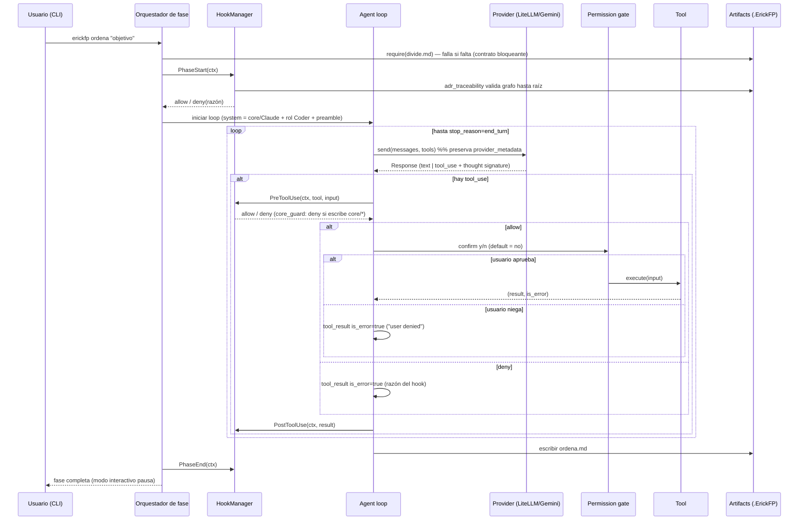

# Diseño: MVP núcleo cartesiano de ErickFP (Ciclo Cogito)

## Enfoque técnico

Traducimos la arquitectura por capas de `byo-coding-agent` (Go) a Python idiomático: un
paquete `src/erickfp/` donde `api` (tipos Provider) no depende de nada, la lógica nunca
depende de la UI, y el *glue* (cli.py + orquestador de fases) vive arriba. El SDK del LLM
se importa **solo** en el adapter LiteLLM. El Ciclo Cogito (`duda→divide→ordena→enumera`)
encadena artefactos markdown como contrato entre fases, gobernado por un motor de hooks
inyectado con restricciones acumulativas y trazable al grafo ADR. Mapea a las specs
`cli-init`, `agent-loop`, `provider-layer`, `tool-registry`, `ciclo-cogito`,
`phase-hooks`, `memory-store`.

## Decisiones de arquitectura

### Decisión 1 — Estructura de paquetes y reglas de dependencia
**Padre ADR**: decisión raíz 2 (Python/Typer) + 3 (legibilidad > extensibilidad).

**Elección**: paquete plano `src/erickfp/` (layout `src/`), un subpaquete por concepto.

```
src/erickfp/
├── api/          types.py: Message, Block, ToolDef, Response, Role, BlockType — SIN dependencias
├── provider/     base.py (Protocol Provider) + litellm_gemini.py (ÚNICO import de litellm)
├── tools/        base.py (Protocol Tool) + registry.py + bash.py, read_file.py, write_file.py
├── cogito/       phases.py (duda/divide/ordena/enumera) + orchestrator.py + artifacts.py + adr.py
├── hooks/        base.py (Protocol Hook) + manager.py + core_guard.py + adr_traceability.py
├── memory/       store.py (Protocol Store) + sqlite_store.py
└── cli.py        Typer: init, chat, duda, divide, ordena, enumera  (glue, toca todo)
```

Regla de dependencia (dirección única, verificable a futuro con import-linter):
`api → nada`; `provider|tools|memory → api`; `hooks → api`; `cogito → api,provider,tools,hooks,memory`;
`cli.py → todo`. La lógica **nunca** importa `cli.py`.

**Alternativas rechazadas**: (a) módulo monolítico `agent.py` — mata la navegabilidad, meta
raíz es aprender; (b) subpaquetes profundos `provider/gemini/` — rompería el auto-registro
de tools y añade ceremonia sin 2ª impl (YAGNI). Python no tiene `internal/` compilado; la
regla se documenta y se enforcea con mypy + import-linter en fase posterior.

### Decisión 2 — Thought signatures de Gemini 3 multi-turno
**Padre ADR**: decisión raíz 4 (Provider propia, prohibido filtrar SDK).

**Elección**: campo opaco `provider_metadata: dict[str, Any] = {}` en `Block` (y `Message`).
LiteLLM devuelve la firma en el mensaje del assistant; el **adapter** la lee de la respuesta,
la guarda en `provider_metadata` del bloque, y en el siguiente `send()` la re-inyecta al
construir el payload LiteLLM. El agent loop y el resto del harness tratan el campo como bytes
opacos: **nunca lo inspeccionan**. Ningún tipo del SDK cruza la frontera del adapter.

| Opción | Trade-off | Decisión |
|--------|-----------|----------|
| `provider_metadata` opaco en Block | Debilita la pureza "intersección"; a cambio round-trip garantizado y frontera intacta | **Elegida** |
| Mapa lateral en el adapter por índice de mensaje | Frágil: la lista de mensajes muta (compaction futura) y desincroniza | Rechazada |
| Exponer campo tipado `thought_signature` en la interfaz | Filtra un detalle de Gemini a todos los providers | Rechazada |

Test de round-trip: enviar → recibir firma → reenviar preservándola; assert que el payload
saliente la contiene y que ningún símbolo `litellm.*` aparece fuera de `provider/litellm_gemini.py`.

### Decisión 3 — Motor de hooks: dependencia inyectada
**Padre ADR**: decisión raíz 9 (agente no edita core) + 8 (grafo ADR).

**Elección**: `HookManager` **inyectado** en el orquestador de fases (NO registry global). El
manager guarda hooks ordenados y un `PhaseContext` mutable con `constraints: list[str]` que se
**acumulan** por fase. Eventos: `PhaseStart`, `PreToolUse`, `PostToolUse`, `PhaseEnd`. Contrato
de bloqueo: cada hook devuelve `HookResult(decision: "allow"|"deny", reason: str)`. En
`PreToolUse`, un `deny` produce `tool_result` con `is_error=true` y `reason` como cuerpo —
**nunca** excepción. Acumulación: los hooks `PhaseStart` añaden restricciones a
`PhaseContext.constraints`; los `PreToolUse` posteriores las leen para decidir.

**Contraste con tools** (que sí usan registry global tipo `Default` de la guía): los tools son
*stateless* y aditivos → registry a nivel de módulo es pragmático y preserva "suelta un archivo
y aparece". Los hooks portan **estado acumulativo por fase** y deben ser deterministas y
testables con un manager fresco por test → DI. Trade-off: DI es más verboso al cablear, pero
casa con "glue arriba" y da aislamiento en tests (robustez innegociable del gate).

Hooks del MVP: `core_guard` (PreToolUse, siempre activo: `deny` si el input escribe en
`.ErickFP/core/*`) y `adr_traceability` (PhaseStart de `ordena`: valida trazabilidad al grafo).

### Decisión 4 — Artefactos del Ciclo Cogito y mapeo de roles
**Padre ADR**: decisión raíz 1 (aprender construyendo) + idea.md (método cartesiano).

**Elección**: un directorio por objetivo bajo `.ErickFP/cogito/{slug-objetivo}/` con
`duda.md`, `divide.md`, `ordena.md`, `enumera.md`. Cada fase, antes de correr, valida que el
artefacto de la fase previa **existe y no está vacío** vía `artifacts.require(prev)`; si falta,
la fase falla con mensaje claro (contrato bloqueante — nada de fases acopladas). El artefacto
que emite alimenta a la siguiente. Roles de `.ErickFP/core/agents/` (Planner/Coder/Reviewer son
archivos markdown = system prompts): `duda`+`divide`→Planner, `ordena`→Coder, `enumera`→Reviewer.
El orquestador carga el archivo de rol como system prompt (compuesto con core/Claude + preamble
del Store).

### Decisión 5 — Interfaces: `typing.Protocol`
**Padre ADR**: decisión raíz 3 (legibilidad + extensibilidad) + 4.

**Elección**: `typing.Protocol` (estructural) para `Provider`, `Tool`, `Store`, `Hook`.
Rationale: refleja las interfaces estructurales de Go (la referencia), permite `MockProvider`
en tests sin heredar, y evita jerarquías rígidas. Donde el registry necesita `isinstance`, se
marca `@runtime_checkable`. Trade-off: Protocol enforcea menos en runtime que ABC → se compensa
con mypy estático. Rechazado ABC: fuerza herencia y acopla implementaciones a una clase base.

```python
# api/types.py — sin dependencias
Role = Literal["user", "assistant"]
BlockType = Literal["text", "tool_use", "tool_result"]

@dataclass
class Block:
    type: BlockType
    text: str = ""
    tool_use_id: str = ""
    tool_name: str = ""
    tool_input: str = ""      # JSON crudo
    tool_result: str = ""
    is_error: bool = False
    provider_metadata: dict[str, Any] = field(default_factory=dict)  # opaco (Decisión 2)

@dataclass
class Message: role: Role; content: list[Block]
@dataclass
class ToolDef: name: str; description: str; input_schema: dict[str, Any]; required: list[str]
@dataclass
class Response: content: list[Block]; stop_reason: str

# provider/base.py
class Provider(Protocol):
    def send(self, messages: list[Message], tools: list[ToolDef]) -> Response: ...
    def model(self) -> str: ...
    def set_model(self, name: str) -> None: ...

# tools/base.py
@runtime_checkable
class Tool(Protocol):
    def definition(self) -> ToolDef: ...
    def execute(self, input: str) -> tuple[str, bool]: ...   # (result, is_error)

# memory/store.py
class Store(Protocol):
    def save(self, entry: Entry) -> None: ...
    def recall(self, query: str, limit: int) -> list[Entry]: ...
    def preamble(self) -> str: ...

# hooks/base.py
@dataclass
class HookResult: decision: Literal["allow", "deny"]; reason: str = ""
class Hook(Protocol):
    event: str                                                # PreToolUse | PostToolUse | PhaseStart | PhaseEnd
    def run(self, ctx: "PhaseContext") -> HookResult: ...
```

### Decisión 6 — Esquema SQLite del Store
**Padre ADR**: decisión raíz 7 (Store SQLite en `.ErickFP/memory/`).

**Elección**: `.ErickFP/memory/erickfp.db`, una tabla:

```sql
CREATE TABLE IF NOT EXISTS entries (
    id      INTEGER PRIMARY KEY AUTOINCREMENT,
    ts      TEXT NOT NULL,                              -- ISO 8601
    kind    TEXT NOT NULL CHECK(kind IN
              ('fact','decision','session-summary','preference')),
    content TEXT NOT NULL,
    tags    TEXT NOT NULL DEFAULT '[]'                  -- JSON array de strings
);
CREATE INDEX IF NOT EXISTS idx_entries_kind ON entries(kind);
```

`save` = INSERT. `recall(query, limit)` = `SELECT ... WHERE content LIKE ? OR tags LIKE ?
ORDER BY ts DESC LIMIT ?`. `preamble()` = últimas N `session-summary` + todas las
`fact`/`preference` (alto valor, bajo volumen), concatenadas como markdown estable
(cache-friendly). Trade-off: LIKE no escala a miles de entradas, pero para el MVP es legible
y sin deps; FTS5/embeddings quedan fuera de alcance (YAGNI).

### Decisión 7 — Grafo ADR: frontmatter y validación de trazabilidad
**Padre ADR**: decisión raíz 8 (grafo ADR con frontmatter) + 9.

**Elección**: ADRs en `.ErickFP/adr/NNN-titulo.md` con frontmatter YAML:

```yaml
---
id: 004                      # entero/único
titulo: "Provider propia con adapter LiteLLM"
parents: [001]               # lista de ids padre; raíz => [] y axioma en core/Claude
estado: aceptada             # propuesta | aceptada | rechazada | amendment
trade_off: "Overhead de traducción a cambio de swappability"
---
```

Algoritmo de validación (hook `adr_traceability`, PhaseStart de `ordena`, pre-síntesis):
1. Parsear todos los ADRs → dict `{id: nodo}`.
2. Para el ADR objetivo, DFS por `parents` acumulando visitados.
3. Alcanza raíz si llega a un nodo con `parents: []` que declara un axioma de `core/Claude`.
4. **Falla** (`deny`) si: id padre inexistente, ciclo detectado (id ya en la pila), o algún
   camino no termina en raíz. `reason` nombra el ADR y el eslabón roto.

Trade-off: recorrer todos los ADRs en cada síntesis es O(n) — trivial para el MVP; se cachea
si el grafo crece.

## Flujo de datos — diagrama de secuencia



## Cambios de archivos

| Archivo | Acción | Descripción |
|---------|--------|-------------|
| `pyproject.toml` | Crear | Paquete `erickfp`, deps Typer + LiteLLM; scripts consola |
| `src/erickfp/api/types.py` | Crear | Message/Block/ToolDef/Response/HookResult/Entry |
| `src/erickfp/provider/{base,litellm_gemini}.py` | Crear | Protocol Provider + adapter (único import LiteLLM) |
| `src/erickfp/tools/{base,registry,bash,read_file,write_file}.py` | Crear | Protocol Tool + registry ordenado + 3 tools |
| `src/erickfp/cogito/{orchestrator,phases,artifacts,adr}.py` | Crear | Fases, contrato de artefactos, validación ADR |
| `src/erickfp/hooks/{base,manager,core_guard,adr_traceability}.py` | Crear | Motor inyectado + 2 hooks |
| `src/erickfp/memory/{store,sqlite_store}.py` | Crear | Protocol Store + impl SQLite |
| `src/erickfp/cli.py` | Crear | Typer: init/chat/duda/divide/ordena/enumera |

## Estrategia de pruebas

| Capa | Qué probar | Cómo |
|------|-----------|------|
| Unit | Permission gate niega por defecto; deny→is_error=true; core_guard bloquea core/*; validación ADR (ciclo, huérfano, raíz OK); recall/preamble; contrato artefacto ausente | pytest con `MockProvider`; sin red |
| Round-trip | thought signature preservada; ningún símbolo `litellm.*` fuera del adapter | test de introspección de imports |
| Integration | `duda→divide→ordena→enumera` encadena artefactos y bloquea ante ambigüedad | orquestador con MockProvider + tmp `.ErickFP/` |
| E2E (manual) | `erickfp init` + `chat` real contra Gemini 3 Flash | smoke con API key |

Robustez innegociable: gate y core_guard con cobertura exhaustiva (riesgos High de la propuesta).

## Migración / Rollout

Sin migración (greenfield). La primera fase de tareas instala pytest+ruff y activa
`strict_tdd: true`. Rollback = descartar rama y borrar `.venv/` + `.ErickFP/`.

## Preguntas abiertas

- [ ] ¿El auto-resumen de sesión (cap.19) es del MVP o fase posterior? Propuesta lo deja
      implícito; recomendación: `save` explícito en el MVP, auto-summary después (YAGNI).
- [ ] Formato exacto del `slug-objetivo` (¿derivado del prompt de `duda` o argumento CLI?) —
      a resolver en tasks.
